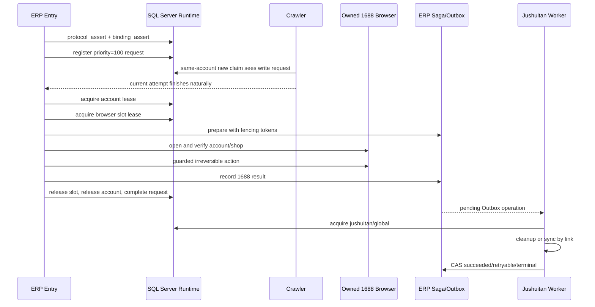
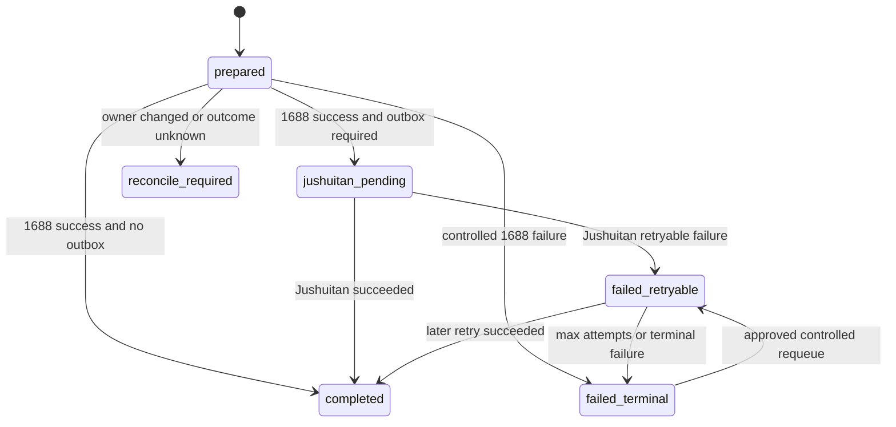

# 1688 跨项目运行时租约 ERP 详细交接文档

日期：2026-08-12
文档状态：开发交接稿，待跨项目统一审核
适用范围：ERP 上架、停产下架、SKU 替换、聚水潭后置处理
开发仓库：`D:\script_files\ERP_cross_project_lease_20260730`
代码目录：`D:\script_files\ERP_cross_project_lease_20260730\furniture-uploader`
当前分支：`codex/1688-cross-project-lease-erp-20260730`
交接代码基线（写文档前）：`9429927f7f63f3cf6ab9d5a83f29cf43e89b22ea`

更新记录（2026-08-18）：合并 Gitee 部署分支 `deploy/cross-project-lease-20260730`（HEAD `16d305a`）至当前分支，合并提交 `d03f31d`。纳入 Edge 驱动版本匹配、隐藏 SKU 校验隔离、outbox 状态查询/requeue 等能力，完整回归通过后 §0.1/§3/§15 已同步更新。三项 P0（§0.3）仍未实现，状态不变。

更新记录（2026-08-19）：Gitee 部署分支再推进至 `23cc650`（自动上架多 SKU 铺货：候选生成、SKU 表格 RPA、登记脚本），合并提交 `5bc05ad`。该分支存在**未提交依赖**：`rpa/listing_review.py`、`rpa/listing_audit.py` 新版及配套 v2 契约测试未随分支提交，已从 `codex/erp-direct-mode-20260814` 恢复并以独立 commit 补齐；恢复后全量 618/618 通过。

## 0. 一页结论

### 0.1 当前做到哪里

ERP 侧已经完成以下开发工作：

- 接入 Crawler 维护的 SQL Server 跨项目运行时协议；
- 上架、下架、SKU 替换入口接入高优先级 request、账号租约和浏览器槽位租约；
- 写入并传播永久 fencing token；
- 增加 ERP 自有 Saga 和聚水潭 Outbox；
- 聚水潭使用 `jushuitan/global` 数据库租约保持全局单路；
- 保留旧文件锁、Crawler Worker/活动任务检查、超时、审计和显式 `--yes` 等兼容门禁；
- 下架和替换继续按“店铺 -> 商品 ID -> 多个 SKU”分组，一个商品编辑页完成多个 SKU 后只提交一次；
- 相同条形码命中的全部 SKU 行都必须下架，并在提交后逐行复核；
- 下架和替换都强制使用商品管理“全部”Tab；
- `运营自行组合替换` 已改为业务跳过 `combination_sku`，不进入租约、Saga、浏览器或聚水潭。

2026-08-12 与 2026-08-18（合并 Gitee 部署分支后）在当前 HEAD 上重新验证：

| 验证项 | 2026-08-12 | 2026-08-19（两次合并+恢复后） |
|---|---:|---:|
| ERP Python 全量测试 | `599/599` 通过 | `618/618` 通过 |
| Python `compileall` | 通过 | 通过 |
| 聚水潭 `npm run check` | 通过 | 通过 |
| 聚水潭测试 | `24/24` 通过 | `24/24` 通过 |
| 聚水潭 `npm run build` | 通过 | 通过 |
| `git diff --check` | 通过 | 通过 |

### 0.2 当前没有做到什么

以下事项没有在本轮完成，也不得被写成“已验收”：

- 未执行生产 Crawler 共享租约 DDL；
- 未执行生产 ERP Saga/Outbox DDL；
- 未部署到执行机；
- 未修改或启用任何执行机计划任务；
- 未启用 `YYDD-1688-Stop-Sale-Daily`；
- 未移除旧全局安全门禁；
- 未启动跨项目并发 Canary；
- 未完成容量 1、2、3 的真实联合验收；
- 未用真实账号、真实 1688 页面、真实聚水潭页面和正式数据库完成本分支验收；
- 未证明本分支可直接替代执行机当前运行版本。

因此当前准确状态是：

> ERP 跨项目租约、Saga、Outbox 的代码已实现并通过本地回归，但仍处于“联合审核前”，不是“生产就绪”或“生产验收完成”。

### 0.3 继续前必须先处理的 P0 差异

代码复核发现三项实现与 2026-07-30 对接契约之间仍需统一审核：

1. **浏览器槽位等待退让**：对齐稿要求短时拿不到槽位时释放账号租约、保留高优先级 request 后退避；当前 `RuntimeLeaseGuard` 持有账号租约并持续心跳等待槽位。
2. **下架/替换页面动作级门禁**：上架把 `runtime_guard.assert_active` 注入 `BrowserRPA`，可在关键页面动作前检查；下架/替换主要由父 Pipeline 每 10 秒检查租约并在失败时终止子进程，子进程页面动作本身尚未逐动作调用租约守卫。
3. **批次 request key 重启稳定性**：上架使用稳定 `operation_key`；下架/替换当前使用包含 `run_id` 的批次 request key。崩溃重启后如果生成新 `run_id`，需要确认不会绕开原 request 的 reconcile 约束。

这三项应在容量 1 联合部署前完成代码或契约层面的明确裁决、测试和独立 commit。容量 2/3 更不能在它们未闭环时启用。

## 1. 背景与目标

同一执行机上存在多类 1688 自动化：

- Crawler 只读爬虫；
- ERP 自动上架；
- ERP 停产 SKU 下架；
- ERP SKU 替换；
- 聚水潭链接清理和按链接同步。

历史实现依赖整机文件锁、计划任务暂停和进程检查。它们能防止一部分重复运行，但不能跨项目、跨进程、跨代码仓库可靠表达以下约束：

- 同一账号 Profile 不能被两个任务同时控制；
- 不同账号可以在受控容量内并发；
- 写操作应优先于后续只读 Crawler，但不能强杀已运行的 Crawler；
- 进程失联后旧 owner 不能继续写业务成功；
- 1688 成功、聚水潭失败时不能丢失后置任务；
- 重试必须幂等，不能因 JSONL 丢失重复修改线上状态。

跨项目方案以 SQL Server 为权威协调面，通过 request、lease、fencing、Saga 和 Outbox 解决这些问题。最终目标是最多 3 个不同 1688 账号浏览器共享执行机容量，但必须按容量 1 -> 2 -> 3 分阶段验证。

## 2. 权威来源与读取顺序

接手者必须按以下顺序核对，不要只读本交接文档：

1. 本仓库 `AGENTS.md`；
2. 本文档；
3. `docs/PROJECT_MEMORY.md`；
4. `docs/DIRECT_1688_PROGRESS.md`；
5. Crawler 对接契约：`D:\script_1688_cross_project_lease_crawler_20260730\docs\368_cross_project_runtime_lease_erp_contract_2026-07-30.md`；
6. 跨项目对齐稿：`D:\script_1688_cross_project_lease_crawler_20260730\docs\366_cross_project_browser_lease_and_stop_sale_deployment_alignment_2026-07-30.md`；
7. Crawler 共享 DDL：`D:\script_1688_cross_project_lease_crawler_20260730\sql\367_ali1688_cross_project_runtime_lease_full_2026-07-30.sql`；
8. ERP 实际代码、测试和 `git status`；
9. 执行机的当前 HEAD、dirty 清单、计划任务、活动 attempt、租约和浏览器槽位证据。

注意：本地 Crawler 集成工作树在 2026-08-12 检查时包含已修改和未跟踪文件。不得把该工作树的未提交 SQL 直接用于生产。生产部署必须选定经过审核的 Crawler commit，并从干净对象生成 bundle 或部署包。

## 3. Git 基线、远端状态与关键提交

### 3.1 ERP 当前状态

| 项目 | 值 |
|---|---|
| 分支 | `codex/1688-cross-project-lease-erp-20260730` |
| 交接代码基线（2026-08-12） | `9429927f7f63f3cf6ab9d5a83f29cf43e89b22ea` |
| 2026-08-18/19 合并提交 | `d03f31d`、`5bc05ad` + 依赖恢复提交（合并 Gitee `deploy/cross-project-lease-20260730`，见 §3.2） |
| 文档提交 | `bdc27882a518d26eb8b3b70a4fa6d2e52fa32275` |
| GitHub `origin` 同名分支 | `60e9551`（2026-08-19 已推送，与本地一致） |
| Gitee `gitee` 同名分支 | `60e9551`（2026-08-19 已从 `6de6a43` 快进同步） |
| Gitee 新分支 `deploy/cross-project-lease-20260730` | `23cc650`（2026-08-19 分两次全部合并入本地） |
| 本轮编辑前工作树 | 干净 |

远端状态（2026-08-19 已推送）：GitHub `origin` 与 Gitee 同名分支均已推至本地 HEAD（含两次部署分支合并与依赖恢复提交）。Gitee 部署分支 `deploy/cross-project-lease-20260730`（`23cc650`）已全部分量合并入本分支；后续执行机如从 Gitee 拉取本分支可直接取得完整 HEAD。部署负责人仍必须按受控方式选择以下一种途径核对后再部署：

- 将审核后的当前分支同步到 Gitee；
- 从开发机创建 Git bundle，经批准的传输通道送到执行机；
- 在独立集成分支中 cherry-pick 审核后的 commit，并解决冲突后生成新部署 SHA。

不得为图省事而在执行机 `stash`、`reset --hard`、`clean` 或覆盖未知修改。

### 3.2 关键提交

| Commit | 作用 |
|---|---|
| `f2f27cd` | ERP 跨项目租约客户端、Saga/Outbox、三个入口基础接入 |
| `854c456` | ERP `profile_ref` 与 Crawler `profile_key` 约定对齐 |
| `d72a1be` | 上架/替换接入受限滑块自动登录能力 |
| `95f5d06` | 协议强制时按协议判断旧 Worker 静止门禁 |
| `1790dc2` | 等待当前 Crawler 前先登记高优先级写 request |
| `285439a` | 已成功 Saga 的幂等重放优先返回，不被新 fencing 误拒绝 |
| `b6d18ba` | 进入聚水潭阶段前释放 1688 运行时租约 |
| `91f4ade` | 每日管理器在协议强制时不再整机暂停 Worker |
| `2e962ec` | 下架计划取数固定到 `JSReportReplica/app` |
| `bfc3c6d` | 聚水潭真实结果核对、Outbox 受控重放 |
| `9429927` | `运营自行组合替换` 业务跳过 |
| `50e3a29` | EdgeDriver 匹配已安装浏览器版本（Gitee 部署分支） |
| `f4e407a` | 检测活动 Edge 可执行文件版本（Gitee 部署分支） |
| `e1690b7` | 隔离 1688 隐藏 SKU 校验（Gitee 部署分支） |
| `08b692e` | outbox 状态查询与 requeue 功能（Gitee 部署分支） |
| `16d305a` | 新增 `requeue_1688_jushuitan_outbox.py` 与 `.gitignore` 更新（Gitee 部署分支 HEAD） |
| `d03f31d` | 2026-08-18 合并 `gitee/deploy/cross-project-lease-20260730`（6 提交，无手工冲突） |
| `23cc650..5863726` | Gitee 部署分支第二波：自动上架多 SKU 铺货（候选生成 `generate_listing_candidates.py`、登记 `register_listing_candidates.py`、SKU 表格 RPA） |
| `5bc05ad` | 2026-08-19 合并部署分支第二波（6 提交，ort 自动合并） |
| （恢复提交） | 从 `codex/erp-direct-mode-20260814` 恢复部署分支未提交依赖：`listing_review.py` v2、`listing_audit.py`、v2 契约测试，618/618 |

这些 commit 中夹有上架草稿修复和合并提交。部署时不能只按表中 commit 零散 cherry-pick 而忽略依赖；应以最终审核分支 HEAD 为整体做 diff 和测试。

### 3.3 Crawler 参考状态

2026-08-12 只读检查得到：

| 项目 | 值 |
|---|---|
| 开发完成起点 | `dcd10ef`，跨项目浏览器租约协议初版 |
| 当前本地分支 HEAD | `f74e0fe` |
| 当前本地分支 | `codex/1688-cross-project-lease-crawler-20260730` |
| 当前工作树 | dirty，包含 tracked 修改和 untracked 临时/热修文件 |
| 对接契约最后提交 | `3b2df0a` 所在历史 |
| 当前共享 DDL | 本地有未提交差异 |

因此 `dcd10ef` 只能说明 Crawler 侧曾完成并推送初版协议，不能代表 2026-08-12 可直接部署的最终 Crawler SHA。主会话必须从 Crawler 权威仓库选择一个干净、完整测试通过、包含最终契约和 SQL 的 commit；不得从当前 dirty 工作树直接复制 SQL。

## 4. 跨仓库 ownership

### 4.1 Crawler 仓库独占

Crawler 仓库是以下共享对象的唯一维护方：

- `app.ali1688_runtime_protocol`；
- `app.ali1688_runtime_lease`；
- `app.ali1688_runtime_request`；
- `app.ali1688_executor_account_binding`；
- request/lease 的 assert、register、acquire、heartbeat、release、complete、recover 存储过程；
- Crawler Worker 的账号租约、浏览器槽位、等待/重排和协议门禁；
- `accounts.json` 配置哈希生成与执行机 binding 同步工具；
- 容量 1/2/3 和 enforcement 的管理工具。

ERP 不得复制、重建或修改 `ali1688_runtime_*` 表和共享存储过程。

### 4.2 ERP 仓库独占

ERP 维护：

- Crawler 共享协议的存储过程客户端；
- ERP 上架、下架、替换入口的租约接入；
- ERP 自有 `app.ali1688_operation_saga`；
- ERP 自有 `app.ali1688_operation_outbox`；
- Saga/Outbox 状态推进、claim、CAS 完成和受控 requeue；
- 聚水潭 Outbox Worker；
- 1688 页面动作、业务审计、Summary、证据和钉钉通知；
- 下架/替换的“全部”Tab、商品分组、多 SKU 和重复条形码处理。

### 4.3 聚水潭子项目 ownership

`jushuitan-sku-offline-batch` 维护：

- `cleanup:1688`：停产下架后解除/清理 1688 链接；
- `sync:1688`：SKU 替换后执行“手动同步商品 -> 按链接同步 -> 立即下载”；
- 店铺、商品 ID、SKU、平台店铺商品编码的精确匹配；
- 每条 operation 的结构化结果；
- 页面级成功、已清理、已同步和失败分类。

它不拥有跨项目账号/浏览器租约，也不直接更新 ERP Saga；Outbox Worker 根据其逐条结果做 CAS 回写。

### 4.4 账号和秘密的权威边界

- `app.crawler_account_shop`：账号/店铺身份权威名册；
- `app.ali1688_executor_account_binding`：执行机非敏感 binding；
- `C:\ProgramData\YYDD\1688-crawler\config\accounts.json`：执行机本地缓存，不是第二业务权威；
- Windows Credential Manager：密码、Cookie、Webhook secret 等秘密的唯一允许存储位置；
- 代码、命令行、Git、日志、截图说明和交接文档不得出现明文秘密。

## 5. 代码文件清单

### 5.1 跨项目运行时客户端

| 文件 | 职责 |
|---|---|
| `rpa/cross_project_runtime.py` | 协议断言、binding 校验、request、account/browser slot lease、心跳、fencing、失联停机、Jushuitan 全局租约 |
| `tests/test_cross_project_runtime.py` | 配置哈希、binding、获取顺序、环境变量和 shared-object ownership 测试 |

### 5.2 Saga 与 Outbox

| 文件 | 职责 |
|---|---|
| `rpa/operation_saga.py` | Saga 准备、1688 结果落库、Outbox claim/finish/requeue、CAS 和 fencing |
| `rpa/sku_operation_saga.py` | 下架/替换 operation key、payload、1688 结果到 Outbox 的转换 |
| `sql/362_ali1688_operation_saga_outbox.sql` | 仅创建 ERP 自有 Saga/Outbox 表、索引和 `app_writer` 权限 |
| `scripts/apply_1688_operation_saga_ddl.py` | 默认 validate + rollback；显式 `--apply` 才提交 |
| `scripts/run_1688_jushuitan_outbox_worker.py` | 在 `jushuitan/global` 租约下 claim、执行、回写 |
| `scripts/requeue_1688_jushuitan_outbox.py` | 单个 operation 的预览/受控 requeue |
| `tests/test_operation_saga.py` | operation key、状态推进、DDL ownership、requeue CAS |
| `tests/test_jushuitan_outbox_worker.py` | 命令、逐条结果、部分失败、重试/终态 |

### 5.3 正式业务入口

| 文件 | 职责 |
|---|---|
| `scripts/run_1688_listing_task.py` | 上架单任务的租约、Saga、页面守卫和结果记录 |
| `scripts/run_1688_stop_sale_pipeline.py` | 下架 Pipeline、租约、审计、分组执行、Outbox Worker 调用 |
| `scripts/run_1688_sku_replace_pipeline.py` | 替换 Pipeline、业务跳过、租约、审计、Outbox Worker 调用 |
| `scripts/manage_1688_stop_sale_daily.py` | 每日下架按店铺/商品批次调度；协议强制时切换 Worker 处理策略 |
| `rpa/browser_rpa.py` | 上架浏览器动作守卫和平台操作 |
| `rpa/sku_offline_main.py` | 下架/替换分店、分商品、重试、自动登录、异常和 handoff |
| `rpa/sku_offline_browser.py` | “全部”Tab、编辑页、多 SKU/重复条形码、提交与持久化复核 |
| `rpa/sku_offline_tasks.py` | 数据读取、过滤、去重、按店铺/商品分组、组合货号分类 |

### 5.4 聚水潭子项目

| 文件 | 职责 |
|---|---|
| `jushuitan-sku-offline-batch/src/1688-link-cleanup-browser.ts` | 页面操作、店铺选择、行匹配、清理/同步 |
| `jushuitan-sku-offline-batch/src/1688-link-cleanup-core.ts` | 输入身份、分组、幂等和结果汇总 |
| `jushuitan-sku-offline-batch/tests/1688-link-cleanup-browser.test.ts` | 页面动作与 fallback 测试 |
| `jushuitan-sku-offline-batch/tests/1688-link-cleanup-core.test.ts` | 身份、分组、结果契约测试 |

## 6. 共享协议常量

| 名称 | 当前值 |
|---|---:|
| `protocol_name` | `ali1688-cross-project-lease` |
| `protocol_version` | `1` |
| Crawler priority | `10` |
| ERP listing/stop_sale/sku_replace priority | `100` |
| request/lease TTL | `120` 秒 |
| heartbeat interval | `20` 秒 |
| heartbeat 连续失败阈值 | `2` |
| 最后成功后失联停止阈值 | `40` 秒 |
| owned Browser 关闭期限 | `20` 秒 |
| 最大协议容量 | `3` 个浏览器槽位 |
| 聚水潭资源 | `jushuitan/global` |

所有 TTL、过期和排序判断必须使用 SQL Server 时间。客户端本机时间只能用于日志，不能作为抢占或恢复依据。

## 7. 账号配置与哈希规则

### 7.1 `accounts.json` 必要元数据

协议强制前，顶层至少应具备：

```json
{
  "config_revision": "<approved-revision>",
  "config_hash": "<64-char-lowercase-sha256>",
  "target_hostname": "<approved-executor-hostname>",
  "accounts": []
}
```

每个启用账号至少要能解析：

- `account_key`；
- `profile_ref` 或 `profile_key` 或 `browser_profile_dir`；
- 正整数 `cdp_port`；
- `enabled != false`；
- 下架/替换自动登录所需的 `expected_member_id` 和店铺身份配置。

### 7.2 哈希算法

ERP 的实现规则：

1. 复制完整 JSON 对象；
2. 删除顶层 `config_hash`；
3. `sort_keys=true`；
4. `ensure_ascii=true`；
5. JSON 分隔符无空格；
6. 对 UTF-8 字节计算 SHA-256；
7. 使用常量时间比较声明值和计算值。

只要账号、Profile、CDP、启用状态、credential reference 或其他配置字段变化，哈希都应变化。哈希不匹配必须 `runtime_config_hash_mismatch` fail closed。

### 7.3 binding 校验

本地解析通过后，ERP 调用：

```text
app.usp_ali1688_executor_binding_assert
```

比较：

- hostname；
- account key；
- profile reference；
- CDP port；
- config revision；
- config hash。

`enforcement_enabled=1` 时必须精确匹配。任何不匹配都不得启动浏览器。

## 8. 正式调用顺序

目标时序如下：



当前代码与目标时序的三项差异见第 0.3 节和第 18 节。

### 8.1 写 request

- 写操作优先级为 100；
- request 在等待当前同账号 Crawler 自然结束前登记；
- 等待期间持续 request heartbeat；
- 不强杀当前 Crawler；
- Crawler 看到高优先级写 request 后不得为同账号领取新 attempt；
- 同优先级写请求由数据库 request sequence 保证 FIFO。

### 8.2 账号租约与浏览器槽位

- `resource_type=account, resource_key=<account_key>`；
- `resource_type=browser_slot, resource_key=<hostname>:<1..capacity>`；
- 同一账号任意时刻只有一个 owner；
- 槽位是全机共享总量，不是每个项目各自拥有；
- 获取成功后保存数据库返回的 `fencing_token`；
- release 必须携带 owner token + fencing token 做 compare-and-set；
- release 不删除资源行，不重置 fencing token。

### 8.3 失联保护

当 request/account/slot heartbeat 连续失败 2 次，或距最后成功达到 40 秒：

1. 标记租约丢失；
2. 拒绝新的页面动作；
3. 父 Pipeline 终止本任务子进程树；
4. 关闭本任务注册的 Browser closer；
5. 不写业务成功终态；
6. 尝试 CAS release；
7. 后续必须通过 TTL、PID、Saga、真实页面和审计证据恢复。

不得全局结束 Edge/Python/Node，也不得删除数据库租约行。

## 9. Saga 设计

### 9.1 operation key

Saga 主键是 64 位 SHA-256。

| 业务 | 幂等身份 |
|---|---|
| listing | `task_type + account_key + task_id` |
| stop_sale | `store_name + product_id + online_sku + platform_store_item_code` |
| sku_replace | `store_name + product_id + online_sku + replacement_sku` |

所有字符串先去除空白并转小写。下架包含平台店铺商品编码，用于区分同店同商品同 SKU 的不同链接身份；替换包含新 SKU，用于区分不同替换目标。

### 9.2 `prepared` 前置条件

Saga `prepare` 要求：

- account fencing token > 0；
- browser slot fencing token > 0；
- operation payload 已确定；
- owner token 只存 SHA-256，不存明文；
- 写入发生在不可逆 1688 页面动作前。

同 operation 已是 `completed`、`ali1688_success` 或 `jushuitan_pending` 时，幂等重放直接返回当前状态。已是 `prepared` 但 owner/fencing 变化时，状态转 `reconcile_required`，禁止直接覆盖重做。

### 9.3 Saga 状态机



数据库 check constraint 允许：

- `prepared`；
- `ali1688_success`；
- `jushuitan_pending`；
- `completed`；
- `failed_retryable`；
- `failed_terminal`；
- `reconcile_required`。

`ali1688_success` 当前主要用于兼容/历史状态，正常有聚水潭后置动作的 SKU 流程直接进入 `jushuitan_pending`。

### 9.4 结果事实源

事实优先级：

1. 正式数据库 Saga/Outbox 和业务审计行；
2. 真实页面提交后复核证据；
3. Pipeline Summary 和逐条 JSONL；
4. 控制台输出。

JSONL 是证据载体和子进程交接文件，不是唯一业务事实源。缺 JSONL 不能自动重做，必须先查 Saga 和真实页面。

## 10. Outbox 设计

### 10.1 Topic

| 1688 业务 | Topic | 聚水潭动作 |
|---|---|---|
| stop_sale | `jushuitan.cleanup_1688_link` | 清理 1688 链接 |
| sku_replace | `jushuitan.sync_1688_link` | 按链接同步并立即下载 |

### 10.2 状态机

Outbox 状态：

- `pending`：等待领取；
- `claimed`：带 claim token 和 claim expiry 的处理中；
- `failed_retryable`：延迟后可再次领取；
- `succeeded`：逐条成功终态；
- `failed_terminal`：达到最大尝试或明确终态。

领取使用 `UPDLOCK + READPAST + ROWLOCK`，按 `available_at, outbox_id` 排序。每次 claim：

- 生成新的 claim token；
- 增加 `attempt_count`；
- 设置 `claim_owner` 和 `claim_until`；
- 完成回写必须命中相同 outbox id + claim token；
- CAS 不命中时抛 `outbox_claim_compare_and_set_failed`。

### 10.3 聚水潭全局单路

Outbox Worker 在 claim 前取得：

```text
resource_type = jushuitan
resource_key  = global
```

1688 账号租约和浏览器槽位必须在进入聚水潭前释放。当前下架回归明确覆盖这一顺序；替换代码也在 `finally` 中释放后才进入聚水潭阶段，但应补一条同等强度的专门顺序测试。

### 10.4 逐条结果优先

Node CLI 可能因同批某一条失败而返回非零批次退出码。Worker 不能因此把同批已通过真实页面验证的成功条目回滚为失败。以下逐条状态被视为成功：

- `success`；
- `already_cleared`；
- `already_synced`。

缺失或失败记录按 attempt count 进入 `failed_retryable` 或 `failed_terminal`。

### 10.5 受控 requeue

只能按单个 64 位 `operation_key` 操作，并要求：

- 当前 Outbox 状态与 `--expected-status` 精确一致；
- 可选 `--expected-error-code` 精确一致；
- Saga 状态仍对应失败状态；
- 必须提供人工审核原因；
- 默认只预览，显式 `--yes` 才更新。

禁止“全部失败重跑”、按日期无差别 requeue 或绕开当前状态 CAS。

## 11. 业务入口说明

### 11.1 自动上架

入口：`scripts/run_1688_listing_task.py`

当前接入颗粒度：

- 每个 listing task 构造稳定 operation key；
- 保留账号级旧 `GlobalFileLock`；
- 进入 `RuntimeLeaseGuard` 后取得 account + browser slot；
- 将 `runtime_guard.assert_active` 注入 `BrowserRPA`；
- 注册 owned browser closer；
- 页面打开、工作流动作、草稿保存、提交等关键步骤前调用动作守卫；
- 不可逆动作前写 `prepared`；
- 成功/受控失败按 fencing 回写 Saga；
- 非预期异常保留 `prepared`，等待 reconcile。

上架当前仍受独立的草稿身份、字段持久化、审核和业务 acceptance 规则约束。跨项目租约通过不等于允许提交商品。

### 11.2 停产下架

入口：`scripts/run_1688_stop_sale_pipeline.py`

执行粒度：

- Pipeline 输入必须先去重和店铺过滤；
- 每个正式执行批次只能绑定一个 `account_key`；
- 高优先级 request 在等待同账号当前 Crawler 前登记；
- 旧文件锁和活动 Crawler 检查继续保留；
- 同店同商品的多个 SKU 在一个编辑页处理；
- 同一个条形码对应多个页面规格行时，全部匹配行都下架；
- 页面运行时状态、提交前状态和提交后状态都做匹配数量复核；
- 同商品只提交一次；
- `success` 或 `already_offline` 才生成聚水潭 cleanup Outbox；
- 1688 平台业务终态、商品不可用、唯一在线 SKU 等只记录/通知，不伪造成功。

商品搜索强制使用：

```text
商品管理 -> 全部 Tab -> 商品 ID 搜索 -> 修改详情
```

URL 的 `tab=all` 不是唯一证据；页面 iframe/SPA 中还要确认“全部”处于 active/selected。失败分类为 `management_tab_mismatch`。

### 11.3 SKU 替换

入口：`scripts/run_1688_sku_replace_pipeline.py`

输入业务规则：

- `平台=Alibaba`；
- `处理说明=全渠道替换`；
- 旧值来自 `线上商品编码`；
- 新值来自 `可替换商品编码（新）`；
- 空值、旧新相同、目标冲突、非法 SKU 按数据异常拒绝；
- 精确值 `运营自行组合替换` 是业务跳过，不是数据异常。

执行规则：

- “全部”Tab 搜索；
- 同店同商品多个替换映射先做整组冲突检查；
- 一次性修改 SKU 表；
- 同商品只提交一次；
- 重新打开编辑页逐项验证新货号；
- `success` 或 `already_replaced` 才生成 `sync_by_link` Outbox；
- 全批仅组合货号时返回 `business_skipped`，`online_actions_started=false`。

### 11.4 每日下架管理器

入口：`scripts/manage_1688_stop_sale_daily.py`

当前能力：

- Preview 与 execute 分离；
- `--yes` 才允许 execute；
- 按店铺、商品 ID 组织批次；
- 同一店铺串行；
- 参数支持 `--max-parallel-stores 1..4`；
- 协议未强制时保持旧 Worker 暂停逻辑；
- 协议强制且入口通过协议管理时，可以跳过整机 Worker 暂停；
- 管理器单实例锁仍保留。

注意：参数允许 4 不代表生产批准 4。跨项目正式总容量上限是 3，且当前尚未通过容量 1 联合验收。计划任务保持禁用，不能因本地测试通过而启用。

## 12. 旧安全门禁保留策略

当前阶段刻意保留：

- 账号或 Pipeline 文件锁；
- 管理器全局单实例锁；
- Crawler Worker/活动任务检查；
- 最近活动业务审计检查；
- `--yes` execute 确认；
- 每阶段超时和子进程树终止；
- 店铺/member identity 校验；
- 自动登录最多一次、滑块最多 4 次；
- 截图、HTML、JSONL、Summary、正式审计和钉钉；
- 唯一在线 SKU 不自动整商品下架；
- 真实店铺不匹配 fail closed。

旧门禁只能在协议强制、容量 Canary、失联测试和业务验收全部完成后逐项移除。不得一次性删除全部旧锁或把 `allow_active_worker` 当作绕过开关。

## 13. 数据库对象

### 13.1 ERP Saga 表

`app.ali1688_operation_saga` 关键字段：

- `operation_key`；
- `run_id`、`task_type`、`account_key`、`business_key`；
- `state`；
- `owner_token_hash`；
- account/browser-slot fencing token；
- `ali1688_status`、`jushuitan_status`；
- payload/evidence JSON；
- error code/summary；
- prepared/1688-finished/finished/updated 时间；
- rowversion。

### 13.2 ERP Outbox 表

`app.ali1688_operation_outbox` 关键字段：

- 自增 `outbox_id`；
- 唯一 `operation_key`；
- `topic`、`status`、payload JSON；
- `attempt_count`、`available_at`；
- claim owner/token/until；
- last error；
- created/updated/completed 时间；
- rowversion。

### 13.3 DDL ownership 检查

ERP DDL 必须满足：

- 只创建 `ali1688_operation_saga` 和 `ali1688_operation_outbox`；
- 不出现 `CREATE TABLE app.ali1688_runtime_`；
- 目标数据库必须是 `JSReportReplica`；
- 默认执行回滚；
- `--apply` 才提交；
- 生产 apply 必须在跨项目统一审批后执行。

## 14. 日志、审计和只读查询

### 14.1 本地文件

常见目录：

| 类型 | 目录 |
|---|---|
| 下架 Pipeline Summary | `logs/sku_offline/pipelines/` |
| 下架逐条报告 | `logs/sku_offline/run_reports/` |
| 下架每日管理器 | `logs/sku_offline/scheduler/` |
| 下架 Outbox | `logs/sku_offline/outbox/` |
| 替换 Pipeline Summary | `logs/sku_replace/pipelines/` |
| 替换逐条报告 | `logs/sku_replace/run_reports/` |
| 截图 | `logs/screenshots/` |
| HTML 快照 | `logs/html_snapshots/` |

文件存在不等于数据库已成功，也不等于真实页面最终状态已确认。

### 14.2 Saga/Outbox 只读检查模板

以下仅为 SELECT 模板。执行前必须使用批准的只读或应用审计连接，不得把凭据写入命令：

```sql
SELECT TOP (100)
       operation_key, run_id, task_type, account_key, state,
       ali1688_status, jushuitan_status, error_code, error_summary,
       account_fencing_token, browser_slot_key,
       browser_slot_fencing_token, updated_at
FROM app.ali1688_operation_saga
ORDER BY updated_at DESC;

SELECT TOP (100)
       outbox_id, operation_key, topic, status, attempt_count,
       claim_owner, claim_until, last_error_code,
       last_error_summary, available_at, updated_at
FROM app.ali1688_operation_outbox
ORDER BY updated_at DESC;
```

### 14.3 跨项目租约只读检查

生产查询字段必须以 Crawler 审核后的 SQL 对象为准。至少应核对：

- 协议版本、enforcement、容量；
- waiting/acquiring/running request；
- account、browser_slot、jushuitan 有效租约；
- owner token hash/摘要，不输出秘密；
- hostname、PID、run id、task type、fencing token、heartbeat/expiry；
- 当前 Crawler active/in-flight attempt。

排队任务不要求清零；代码切换和浏览器/数据库写操作只由 fresh active/in-flight、租约和槽位状态门禁。

## 15. 2026-08-12 测试证据

### 15.1 实际执行命令

在 `D:\script_files\ERP_cross_project_lease_20260730\furniture-uploader`：

```powershell
python -X utf8 -m unittest discover -s tests -p "test_*.py"
python -m compileall -q rpa scripts
```

在 `D:\script_files\ERP_cross_project_lease_20260730\jushuitan-sku-offline-batch`：

```powershell
npm run check
npm test
npm run build
```

在仓库根目录：

```powershell
git diff --check
```

### 15.2 结果

- Python：`Ran 618 tests ... OK`（2026-08-19 两次合并部署分支并恢复缺失依赖后复测，基线 599）；
- `compileall`：退出码 0；
- TypeScript check：退出码 0；
- Node tests：24 tests，24 pass，0 fail；
- TypeScript build：退出码 0；
- `git diff --check`：退出码 0。

### 15.3 如何解释测试输出

测试会打印模拟的：

- `login_required`；
- 风控/滑块；
- Draft unavailable；
- DingTalk rejected；
- 业务终态；
- 失败和 partial Summary。

这些是测试夹具验证异常分支，不是 2026-08-12 的线上执行失败，也不是线上成功。验收报告必须引用最终 unittest 结果和具体真实 run/audit 证据，不能截取测试日志中的模拟 JSON 当生产记录。

### 15.4 已覆盖与未覆盖

已覆盖：

- 配置哈希和 binding fail closed；
- request 一次登记、account -> slot 获取顺序；
- fencing 环境传播；
- Saga prepare、结果、Outbox、CAS/requeue；
- 下架/替换 Pipeline 组装和主要异常；
- 下架释放租约后才进入聚水潭；
- 同商品多 SKU、重复条形码、全部 Tab；
- 组合货号业务跳过；
- 聚水潭逐条成功优先于批次退出码。

尚未覆盖或需加强：

- 槽位长期繁忙时释放账号租约并保留 request 的退让策略；
- 下架/替换每个不可逆页面动作前的进程内租约检查；
- 下架/替换崩溃重启时稳定 request key 和 reconcile；
- 替换 Pipeline 明确验证“租约释放先于聚水潭”的专门顺序测试；
- 真实 SQL Server 断连 40 秒后的进程/Browser 停机联合测试；
- Crawler + ERP 跨仓库容量 1/2/3 联合测试；
- 执行机真实账号、真实页面、正式审计和钉钉验收。

## 16. 部署前检查

本节是未来批准部署后的步骤，不构成当前部署授权。

### 16.1 开发侧

1. 解决第 18 节 P0 项或形成双方签字的契约裁决；
2. ERP 工作树干净；
3. Crawler 工作树干净；
4. 双方 commit 均已推送或制成可验证 bundle；
5. 记录 bundle SHA-256；
6. 完整测试重新通过；
7. secret scan 无高置信秘密；
8. `git diff --check` 通过；
9. 审核 ERP 未创建 Crawler runtime 对象；
10. 审核 Crawler DDL 与 ERP protocol version 完全匹配。

### 16.2 执行机只读门禁

先检查，不修改：

- hostname 是否为批准执行机；
- ERP/Crawler 当前 HEAD；
- 两仓 dirty/untracked 清单；
- 当前计划任务定义和状态；
- 当前 active/in-flight crawler attempt；
- 当前 listing/stop_sale/replace 运行进程；
- 当前 account/browser-slot/jushuitan 租约；
- 当前 Saga `prepared/reconcile_required/claimed`；
- 当前账号 Profile/CDP 占用；
- `accounts.json` revision/hash/hostname；
- Credential Manager 引用是否存在，但不读取或输出秘密。

任何 unknown 状态都不能写成 0。计划任务 Ready、进程数 0 或 `LastTaskResult=0` 不能单独代替租约和 active attempt 证据。

### 16.3 dirty worktree 处理

发现本地修改时：

1. 输出 tracked modified、untracked、deleted 清单；
2. 识别每个文件 ownership 和是否与部署 diff 重叠；
3. 不 stash；
4. 不 reset；
5. 不 clean；
6. 不 checkout 覆盖；
7. 在独立 worktree 或临时集成分支审阅冲突；
8. 只把明确可保留的执行机修复形成独立 commit；
9. 临时诊断脚本和明文配置不得进入正式 commit。

## 17. 执行机部署方案与回滚

### 17.1 推荐的离线 bundle 方案

开发机在审核完成后生成 bundle，示例：

```powershell
Set-Location D:\script_files\ERP_cross_project_lease_20260730
git status --short --branch
git bundle create D:\script_files\deployments\erp-cross-project-lease-approved.bundle `
  codex/1688-cross-project-lease-erp-20260730
git bundle verify D:\script_files\deployments\erp-cross-project-lease-approved.bundle
Get-FileHash D:\script_files\deployments\erp-cross-project-lease-approved.bundle -Algorithm SHA256
```

传输命令中的主机、用户和目标路径由执行机管理员填写，不应把密码写在命令或文档中。

执行机收到后先验证 hash，再只 fetch 到临时 remote ref：

```powershell
Set-Location D:\deploy\erp-stop-sale
git status --short --branch
git bundle verify D:\deploy\packages\erp-cross-project-lease-approved.bundle
git fetch D:\deploy\packages\erp-cross-project-lease-approved.bundle `
  refs/heads/codex/1688-cross-project-lease-erp-20260730:refs/remotes/bundle/erp-cross-project-lease
git show --stat --oneline refs/remotes/bundle/erp-cross-project-lease
```

此时仍不切换运行代码。若执行机有 dirty 修改，在独立 worktree 做集成和测试；不能直接覆盖当前目录。

### 17.2 DDL 顺序

仅在统一审批后：

1. Crawler 共享 DDL validate-only；
2. 审核对象、过程、协议版本和容量；
3. Crawler 共享 DDL显式 apply；
4. ERP Saga/Outbox DDL validate-only；
5. ERP DDL显式 apply；
6. 两边 contract check；
7. 初始 `enforcement_enabled=0`、capacity=1；
8. 保留旧门禁。

ERP DDL validate-only 模板：

```powershell
Set-Location <approved-erp-runtime>\furniture-uploader
python scripts\apply_1688_operation_saga_ddl.py `
  --shared-runtime-root E:\1688\1688-script-new
```

没有 `--apply` 时必须回滚。生产 `--apply` 不在本次授权范围内。

### 17.3 代码切换

代码切换前不要求 queued task 清零，但必须确认：

- 当前 active/in-flight attempt 为 0；
- 没有有效账号/浏览器槽位租约；
- 没有当前 ERP 页面写进程；
- 没有未 reconcile 的本次目标 operation；
- 当前 Profile 没有被其他 owner 使用。

切换后只运行本地测试、preflight 和只读 contract check。不得自动启用每日计划任务。

### 17.4 回滚

回滚顺序：

1. 停止创建新的 ERP 写 request；
2. 不抢占正在运行的 owner，等待当前受控任务结束或按 owned-process 流程停止；
3. 容量降回 1；
4. enforcement 回到批准的兼容状态；
5. 恢复上一批准 ERP/Crawler SHA；
6. 保留数据库租约、request、event、Saga、Outbox 和审计；
7. 对未完成 Saga 做只读 reconcile；
8. 恢复原计划任务状态必须有部署前快照和明确批准。

禁止回滚动作：

- 删除 lease/request 行；
- 重置 fencing token；
- 清空 Saga/Outbox；
- 全局杀 Edge/Python/Node；
- 删除未知锁文件；
- 把失败行改成 success；
- 直接恢复每日任务而不做容量 1 验收。

## 18. 分阶段联合验收

### 18.1 阶段 0：P0 代码/契约闭环

必须完成：

- 槽位繁忙账号租约退让；
- 下架/替换页面动作级 guard；
- 稳定 request key/reconcile；
- 替换释放顺序测试；
- 双仓协议版本和错误码矩阵对齐；
- 新 commit、完整测试和文档更新。

### 18.2 阶段 1：容量 1 兼容部署

前提：旧安全门禁保留，enforcement 初始关闭或兼容，capacity=1。

验收清单：

1. Crawler 单账号只读任务能申请/心跳/释放租约；
2. 上架使用批准的 dry-run/draft 场景，不越过独立上架审核门禁；
3. 下架用一个批准 SKU 执行真实 Canary；
4. 替换用一个批准旧 SKU -> 新 SKU 执行真实 Canary；
5. 聚水潭 cleanup/sync 各验证一条；
6. 每条核对 request、account/slot fencing、Saga、Outbox、业务审计、Summary、页面证据和通知；
7. 数据库断连/租约丢失测试确认 owned process 停止且不写成功；
8. Crash/restart 测试确认 reconcile，不重复页面动作。

通过标准不是退出码 0，而是所有指定证据一致。

### 18.3 阶段 2：容量 2 Canary

必须验证：

- 账号 A Crawler + 账号 B 下架可并行；
- 账号 A Crawler 运行时，账号 A 下架登记 request 并等待，Crawler 不被强杀；
- 当前 Crawler 结束后写操作优先于同账号新 Crawler；
- 两个不同账号写操作可占两个槽位；
- 聚水潭仍严格单路；
- 槽位繁忙时不长期占住无槽位账号；
- 任何一方数据库失联只关闭自身 Browser；
- 旧 owner fencing 不能回写成功。

容量 2 通过前不得移除包围整个 Pipeline 的旧全局门禁。

### 18.4 阶段 3：容量 3

容量 2 稳定后才允许：

- 将 capacity 显式升到 3；
- 验证三个不同账号共享总容量；
- 第四个任务正确等待/requeue，不启动浏览器；
- 验证 Crawler + listing + stop_sale/replace 混合场景；
- 连续真实周期验收；
- 再评审旧门禁的逐项移除。

管理器 `--max-parallel-stores` 即使允许 4，也必须受数据库 capacity=3 限制，不得把参数上限当生产容量。

## 19. 真实验收证据模板

每个 Canary 至少回传：

| 类别 | 必须字段 |
|---|---|
| Git | Crawler SHA、ERP SHA、是否 dirty |
| 协议 | protocol/version/enforcement/capacity |
| 身份 | hostname、account_key、shop/member 校验结果，不含秘密 |
| Request | request_key、priority、sequence、状态、heartbeat/expiry |
| Lease | account/slot key、fencing token、owner 摘要、获取/释放时间 |
| Saga | operation_key、state、1688/JST status、error、updated_at |
| Outbox | topic、status、attempt、claim、error |
| 1688 | 商品 ID、SKU、操作前后状态、提交请求/复核证据 |
| 聚水潭 | 精确身份、操作、逐条状态、页面复核 |
| 业务审计 | run/item 终态及计数 |
| 文件 | Summary、JSONL、截图、HTML 路径 |
| 通知 | notification_sent 和钉钉响应摘要 |
| 调度 | 原状态、测试期间状态、恢复后状态 |

生产完成声明必须同时有数据库业务行或明确 expected-empty 证据。`LastTaskResult=0`、进程结束、浏览器关闭、Preview 成功都不是业务完成证明。

## 20. 中文异常分类与处理

| 技术编码/现象 | 中文分类 | 自动处理边界 |
|---|---|---|
| `runtime_protocol_missing/version_rejected` | 协议缺失或版本不兼容 | 停止入口，不开浏览器 |
| `runtime_config_*` | 执行机账号绑定/配置不一致 | 停止对应账号，不修配置后重试 |
| `resource_lease_busy` | 资源正在使用 | 保持 request 心跳、受控等待 |
| `higher_priority_account_write` | 高优先级写任务等待 | Crawler 不领同账号新任务 |
| `expired_owner_requires_recovery` | 过期 owner 需要恢复审核 | TTL + PID + 页面/Saga reconcile 后 CAS 恢复 |
| `runtime_lease_lost` | 运行时租约丢失 | 停止新动作、关闭 owned Browser、不写成功 |
| `stale_account_fencing_token` | 旧 fencing 回写 | 拒绝写入，进入 reconcile |
| `owner_changed_after_prepare` | Saga owner 变化 | `reconcile_required`，禁止盲重试 |
| `outbox_claim_compare_and_set_failed` | Outbox claim 已变化 | 重读数据库，不覆盖其他 Worker |
| `login_required` | 登录失效 | 账号级自动登录一次，身份复核 |
| slider unresolved/risk control | 滑块或风控未解决 | 最多 4 次受限滑块；其他风控记录通知 |
| `store_mismatch/member_id_mismatch` | 店铺/账号身份不匹配 | 对应店铺 fail closed |
| `management_tab_mismatch` | 未确认商品管理“全部”Tab | 停止对应店铺写操作 |
| `management_search_timeout` | 商品管理搜索超时 | 当前店铺 Browser 重建后有界重试 |
| `product_unavailable` | 商品不可用/不存在 | 业务终态，记录并通知 |
| `sole_sku_requires_product_offline` | 下架后无在线 SKU | 业务终态，不自动整商品下架 |
| `sku_not_found` | 未找到目标 SKU | 记录证据，避免盲改其他 SKU |
| `combination_sku` | 组合货号 | 业务跳过，不进入线上动作 |
| Jushuitan retryable | 聚水潭可重试异常 | Outbox 延迟重试，有最大次数 |
| Jushuitan terminal | 聚水潭终态失败 | 通知，人工审核后仅单条 requeue |

业务异常应通过审计和钉钉通知闭环，不应卡住其他独立店铺。但“通知了”不等于“操作成功”；成功、业务终态、技术失败必须分开统计。

## 21. 禁止事项

在统一批准前不得：

1. 执行生产 DDL；
2. 修改执行机计划任务；
3. 启用 `YYDD-1688-Stop-Sale-Daily`；
4. 部署本分支到执行机；
5. 启动跨项目并发测试；
6. 移除旧全局安全门禁；
7. 强杀未知 Edge/Python/Node；
8. 删除锁、lease、request、Saga、Outbox 或审计行；
9. 绕过验证码、风控或店铺身份校验；
10. 广泛重跑失败任务；
11. 把本地测试/Preview 写成生产验收；
12. 在日志、命令或文档中输出密码、Cookie、Webhook 或 secret；
13. 在 dirty 执行机仓库 stash/reset/clean/覆盖；
14. 在 Gitee 分支未同步时声称执行机已取得代码基线 `9429927` 和文档提交 `bdc2788`；
15. 用 queued task 数量作为部署阻塞；真正门禁是 fresh active/in-flight、租约和浏览器槽位。

## 22. 后续任务优先级

### P0：联合部署前

1. 修复/裁决第 0.3 节三项协议差异；
2. 补替换租约释放顺序测试；
3. 重新跑 ERP 618、聚水潭 24 和 Crawler 全量测试；
4. 双方审核最终 SQL 和 protocol version；
5. 生成干净、可验证的 ERP/Crawler commit；
6. 同步 Gitee 或制作 bundle；
7. 输出最终部署 diff、rollback SHA 和 secret scan。

### P1：容量 1

1. 执行机只读预检；
2. DDL validate-only；
3. 审批后 apply；
4. 协议兼容模式、容量 1；
5. Crawler、上架、下架、替换、聚水潭逐条 Canary；
6. 数据库和页面双证据验收；
7. 保持每日任务禁用。

### P2：容量 2/3

按第 18 节逐级执行。任何阶段失败都回到容量 1，不得跳级。

## 23. 接手者回报格式

接手会话第一条回复应包含：

1. ERP 集成基线、目标分支、HEAD、两个远端状态；
2. Crawler 协议基线、DDL SHA、工作树是否干净；
3. 上架、下架、替换、聚水潭和共享协议 ownership；
4. 三项 P0 差异的处理决定；
5. 本地单测、跨项目测试和真实 Canary 清单；
6. 执行机部署与回滚步骤；
7. 明确声明当前是否获得生产 DDL、部署、计划任务或并发测试授权。

完成一个阶段后的报告应分成：

- **代码状态**：commit、diff、测试；
- **部署状态**：执行机 HEAD、dirty、DDL、配置；
- **运行状态**：request/lease/attempt/Browser；
- **业务状态**：1688、聚水潭、Saga/Outbox、审计、通知；
- **未完成项**：技术失败、业务终态、待人工动作；
- **回滚状态**：计划任务、Worker、容量、enforcement 是否恢复。

## 24. 最终交接结论

ERP 侧已经从“本地文件锁 + 同步执行”演进为“数据库权威租约 + fencing + Saga + Outbox”的代码基线，并保留了历史安全门禁。当前 HEAD 的本地回归是完整通过的，组合货号、全部 Tab、同商品多 SKU 和重复条形码等业务规则也已纳入。

但当前仍不能开始生产部署或全量运行。下一步不是直接在执行机执行命令，而是先完成三项 P0 协议差异、双仓干净审核和最终 commit，然后由主会话统一安排容量 1 部署与真实 Canary。只有容量 1 的数据库、页面、审计和通知证据全部一致后，才有资格讨论容量 2；容量 3 是最后阶段。

## 附录 A：ERP 集成分支完整变更清单

以下清单以合并基线 `85041cf` 到交接代码基线 `9429927` 的 Git 差异生成，用于审查和部署，不代表每个文件都只包含租约改造。

### A.1 配置与文档

- `furniture-uploader/config/platforms/1688.json`
- `furniture-uploader/config/systems/1688_sku_replace.json`
- `furniture-uploader/docs/1688_SKU_REPLACE_RUNBOOK.md`
- `furniture-uploader/docs/DELIVERY_HANDOVER_2026-03-24.md`
- `furniture-uploader/docs/DIRECT_1688_PROGRESS.md`
- `furniture-uploader/docs/PLATFORM_EXPERIENCE_KB.md`
- `furniture-uploader/docs/PROJECT_EVOLUTION.md`
- `furniture-uploader/docs/PROJECT_MEMORY.md`
- `furniture-uploader/docs/handoff/1688_LISTING_DRAFT_FIELD_PERSISTENCE_HANDOFF_2026-07-30.md`
- `furniture-uploader/docs/operations/1688_LISTING_CAPACITY_AND_AUDIT_2026-07-22.md`

### A.2 Python 运行代码与 SQL

- `furniture-uploader/rpa/auto_listing_executor.py`
- `furniture-uploader/rpa/browser_rpa.py`
- `furniture-uploader/rpa/cross_project_runtime.py`
- `furniture-uploader/rpa/operation_saga.py`
- `furniture-uploader/rpa/sku_offline_main.py`
- `furniture-uploader/rpa/sku_offline_tasks.py`
- `furniture-uploader/rpa/sku_operation_saga.py`
- `furniture-uploader/rpa/variant_pipeline.py`
- `furniture-uploader/scripts/apply_1688_operation_saga_ddl.py`
- `furniture-uploader/scripts/build_1688_stop_sale_preview.py`
- `furniture-uploader/scripts/inspect_1688_saved_draft.py`
- `furniture-uploader/scripts/manage_1688_stop_sale_daily.py`
- `furniture-uploader/scripts/manage_1688_stop_sale_daily_task.ps1`
- `furniture-uploader/scripts/requeue_1688_jushuitan_outbox.py`
- `furniture-uploader/scripts/run_1688_jushuitan_outbox_worker.py`
- `furniture-uploader/scripts/run_1688_listing_task.py`
- `furniture-uploader/scripts/run_1688_sku_replace_pipeline.py`
- `furniture-uploader/scripts/run_1688_stop_sale_pipeline.py`
- `furniture-uploader/sql/362_ali1688_operation_saga_outbox.sql`

### A.3 Python 测试

- `furniture-uploader/tests/test_auto_listing_executor.py`
- `furniture-uploader/tests/test_browser_rpa_helpers.py`
- `furniture-uploader/tests/test_build_1688_stop_sale_preview.py`
- `furniture-uploader/tests/test_cross_project_runtime.py`
- `furniture-uploader/tests/test_inspect_1688_saved_draft.py`
- `furniture-uploader/tests/test_jushuitan_outbox_worker.py`
- `furniture-uploader/tests/test_manage_1688_stop_sale_daily.py`
- `furniture-uploader/tests/test_operation_saga.py`
- `furniture-uploader/tests/test_run_1688_listing_task.py`
- `furniture-uploader/tests/test_run_1688_sku_replace_pipeline.py`
- `furniture-uploader/tests/test_run_1688_stop_sale_pipeline.py`
- `furniture-uploader/tests/test_sku_offline_main.py`
- `furniture-uploader/tests/test_sku_offline_tasks.py`
- `furniture-uploader/tests/test_stop_sale_pipeline.py`
- `furniture-uploader/tests/test_variant_pipeline.py`

### A.4 聚水潭代码与测试

- `jushuitan-sku-offline-batch/src/1688-link-cleanup-browser.ts`
- `jushuitan-sku-offline-batch/src/1688-link-cleanup-core.ts`
- `jushuitan-sku-offline-batch/tests/1688-link-cleanup-browser.test.ts`
- `jushuitan-sku-offline-batch/tests/1688-link-cleanup-core.test.ts`

## 附录 B：数据库过程调用矩阵

| ERP 客户端方法 | Crawler-owned 存储过程 | 用途 |
|---|---|---|
| `assert_protocol` | `usp_ali1688_runtime_protocol_assert` | 协议版本、enforcement、容量 |
| `assert_binding` | `usp_ali1688_executor_binding_assert` | hostname/account/Profile/CDP/config 校验 |
| `register_request` | `usp_ali1688_runtime_request_register` | 登记高优先级写意图 |
| `heartbeat_request` | `usp_ali1688_runtime_request_heartbeat` | 等待/运行期间续租 request |
| `complete_request` | `usp_ali1688_runtime_request_complete` | request 终态 CAS |
| `acquire` | `usp_ali1688_runtime_lease_acquire` | account/browser-slot/jushuitan 租约 |
| `heartbeat` | `usp_ali1688_runtime_lease_heartbeat` | owner + fencing 续租 |
| `release` | `usp_ali1688_runtime_lease_release` | owner + fencing CAS 释放 |

ERP 当前客户端不调用 Crawler 的恢复存储过程。过期 owner 恢复必须由 Crawler 权威工具和审核流程执行，ERP 遇到 `expired_owner_requires_recovery` 时只停止并上报。
